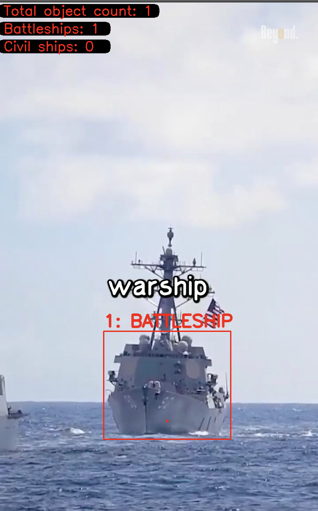

# Ships detection/classification for naval drones


The maritime unmanned attack boat or maritime kamikaze drone has become a revolutionary weapon of the 21st century. In particular, during the war in Ukraine, 1/5 of the Russian Black Sea fleet became victims of this type of weapon. One of the many advantages of this type of weapon is that it is almost impossible to intercept. As machine guns and small missiles are ineffective, as nets and barriers also cannot protect ships from being hit by these drones.

In fact, there is only one surefire way to intercept a drone - electronic warfare technology, which complicates the drone's communication with the control center. However, this problem can also be avoided using computer vision technologies.

This program is a YOLOv8 model, trained on a custom dataset, which is capable of recognizing ships and classifying them as military/civilian.

## Installation

1. Install dependencies:

    ```bash
    pip install opencv-python
    pip install ultralytics
    ```

## Usage

1. Just initialize path to your mediafile or own camera:

    ```bash
    cap = cv2.VideoCapture("path/to/your/file")
    ```

2. After running the program, model  will detect and classify battleships or civil ships on your file.

## Example



1. As you see, program will draw bounding boxes around detected ships.
2. It will also count their total amount and amount of objects of each specific class.
3. It will also draw a point as a target at the bottom of the ship, where the kamikaze drone should aim.


## Notes

- Make sure you have sufficient memory to run the YOLO model, especially if you plan to process large videos.
- The YOLO model is trained to detect ships in general and may not be perfect for all scenarios. Fine-tuning on your own dataset may be required to improve accuracy.
- Custom dataset contains more than 2000 images of different ships.

## Authors

- Kucher Maks / Email: maxim.kucher2005@gmail.com


